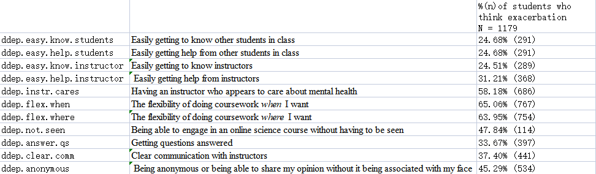

```{r warning = FALSE, results='hide', error=FALSE, message=FALSE}
library(tidyverse)
library(ggplot2)
library(ggpubr)
library(caret)
```
# Literature Review

Depression is described as a common and serious mood disorder that results in persist feelings of sadness and hopelessness, as well as a loss of interest in activities that one once enjoyed (Bob Roehr, 2013). Additional symptoms of depression include weight changes, difficulty sleeping, loss of energy, difficulty thinking or concentrating, feelings of worthlessness or excessive guilt, and suicidality (Bob Roehr, 2013). While depression results from a complex interaction of psychological, social, and biological factors, studies have shown that increased stress caused by college can be a significant contributor to students depression. 

Before 2020, mental disorders were leading causes of the global health-related burden, with depressive and anxiety disorders being leading contributors to this burden.As the field of clinical behavior analysis grows, it will benefit from analyses of increasingly complex and common clinical phenomena, especially those with significant public health implications. One such phenomenon is clinical depression, considered to be the “common cold” of outpatient populations (Jonathan W. Kanter, 2018). Up to 25 million people in the United States alone meet criteria for some type of depressive disorder in a given year (M. B. Keller, 1994).

Students, especially in the science subject may be particularly at risk for depression, given that such majors are noted to be particularly stressful due to their competitive nature and course work that is often perceived to “weed students out” (Cooper, Gin, Barnes and Brownell 2020). Since science courses have always been described as boring, repetitive, difficult, and math-intensive, these factors can trigger students avoid science courses during the time when they are not experiencing the pandemic.  After 2020, the COVID-19 pandemic has disrupted the lives of all including university students. With the preventive measures to reduce the transmission of COVID-19, all face-to-face teaching and learning are converted to e-learning. 

## Current Study

E-learning is not new, with many universities around the world implementing it even before the COVID-19 pandemic. Fast wireless Internet access enables e-learning to take place on mobile devices such as laptops, smartphones and tablets, enabling e-learning to be implemented almost anywhere with a good Internet connection. With the exception of hands-on instruction involving mechanical handling, chemical and biological specimens, almost all learning can be done through e-learning. Even clinical teaching can be conducted to some extent through e-learning, although it can be challenging to conduct clinical examinations and treatments through e-learning.

Most university students are familiar with face-to-face teaching as this is the conventional teaching method implemented since primary and secondary education. When they enter the universities, they may experience multifaceted pressures such as academic workload, economic difficulties and interpersonal relationships. These stressful experiences may put them at high risk of mental health problems such as stress, anxiety and depression. The rapid spread of COVID-19 and measures imposed to slow down the transmission and relieve the public health systems may further affect their mental health status. During the COVID-19 pandemic, university students were reported to experience higher levels of stress and anxiety (Moy and Ng 2021).

In this study, what we have to put most focus on are what type of scenario would let students alleviate or exacerbate their depression due to some cases that they have experienced in e-learning. However, different students have different background and would behave different symptoms whether they would keep depressed or they would not feel so. It is hard to tell whether what group were they or what type were they would affect their opinions to let them feel depressed. To address these differences, we would have some questions that we want to investigate from the students. 

In the data set that we gathered, there are 41 variables, but only one of them is a continuous variable, the GPA, and the rest variables are all categorical variable because the purpose for the query is to ask the rank or nominal data from the students so that researcher can analysis the data from different aspects. 

Here are the four questions that this paper mainly discusses: 

1. Is GPA/Race/Gender/LQBTQ/College Generation Status/Financial Status/STEM major/Year in College a greatest factor that affect students' depression? 
2. Which kind of students would tend to be depressed? 
3. What scenario would alleviate students' depression? 
4. What scenario would exacerbate students' depression? 


# Methods and Sample

## Samples
First, in the data set, since it seems that students who have no depression or refuses to answer the questions all seem to have no experiences from cases of depression, we would like to change the variable of `depression` to answers only contains "yes" and "no". 
```{r, warning = FALSE}
dep <- read.csv("pone.0269201.s002.csv")
dep$depression <- ifelse(dep$depression == "yes", "yes", "no")
dep <- dep %>% mutate(GPA = as.numeric(GPA))
```

Since there are many missing values because there are some students who don't have depression or refuse to answer the question, for cases that that students may experiences, I would like to put the missing value NA to -1 so the data set contains 1, 0, -1. And for other categorical data, I would like to put the missing value NA to "unknown". 
```{r}
missingCol <- grep("idep|ddep", colnames(dep))
dep[, missingCol][is.na(dep[, missingCol])] <- -1
dep[, -missingCol][is.na(dep[, -missingCol])] <- "Unknown"
```

The general information is also required, because the generation information can help to analyze the distribution for students. 
```{r eval = FALSE}
for(i in 34:41) {
  print(stat(table(dep[i])))
  print(prop.table(stat(table(dep[i]))))
}
```

The students' general information showed that almost two-third of the students in this query are women (66.94%), most of these students are continuing-generation students (58.76%), and most of them are STEM majors (55.78%). The following form represents a statistical student information.  


## Methods
To answer the research questions, the data set gives bunch of information of undergraduates enrolled in an in-person degree program who were completing science courses online in summer 2020, fall 2020, and spring 2021. This data set is given to let researchers understand how online science courses would alleviate or exacerbate students' depression symptoms. 

### QR:1. Is GPA/Race/Gender/LQBTQ/College Generation Status/Financial Status/STEM major/Year in College a greatest factor that affect students' depression? 
To answer up what is the greatest factor that affect students' depression, the best way is to visualize them, both in counting the frequency of each variable and the probability table for each variable. 
For GPA, the best way to visualize GPA is to use boxplot and separate it with students who are depressed and students who are not. Boxplots are used to show distributions of numeric data values, especially when we want to compare them to multiple groups. The boxplot will provide information such as the 25% quantile, the median, the 75% quantile, the upper fence and lower fence. 

### QR:2. Which kind of students would tend to be depressed? 

In order to find what properties do student have when they tend to be depressed when having online science course, I decide to use logistic regression to find what would be the significant characteristics. Since the data set of depression has already separated by "yes" and "no", what we have to do is select students race, division, gender, generation status, lgbtq community, and their financial status. We will use the formula such as `train(depression ~ race, division, gender, generation status, lqbtq, financial status)` to find the logistic regression model. Finally, choose the the variables that have `***` in the results, the `***` means that such variable has a small enough p-value which makes the variable to be statistic significant. 

### QR:3. What scenario would alleviate students' depression? 
In this case, we want to first filter the students that had depression and still have depression at present, which gives us a bunch of data set. After this, we have to select all the columns that contains string `ddep`. `ddep` variable mean the aspect of online college science course that might help students manage their depression. We would use the frequency table and probability table to find out what are the common cases that help students to manage their depression. 

### QR:4. What scenario would exacerbate students' depression? 

The case is similar with the case 3, which we also will first filter the students that had depression and still have depression at present, but this time we will select all the columns that contains string `idep`, which means the aspects of online college science courses that might let students' feelings of depression worse. We would also use the frequency table and probability table to find out what are the common cases that make students feel worse about depression.


# Findings

### Finding:1. LGBTQ groups is the greatest factor that affect students' depression, gender identitiy is the second greatest factor that affect students' depression. 
```{r plots, warning = FALSE, echo = FALSE}
count_race <- dep %>% ggplot(aes(x = race2, fill = depression)) + 
  geom_bar(alpha = 0.3)
perc_race <- dep %>% ggplot(aes(x = race2, fill = depression)) + 
  geom_bar(alpha = 0.3, position = "fill")
count_gender <- dep %>% ggplot(aes(x = gender2, fill = depression)) + 
  geom_bar(alpha = 0.3)
perc_gender <- dep %>% ggplot(aes(x = gender2, fill = depression)) + 
  geom_bar(alpha = 0.3, position = "fill")
count_lgbtq <- dep %>% ggplot(aes(x = lgbtq2, fill = depression)) + 
  geom_bar(alpha = 0.3)
perc_lgbtq <- dep %>% ggplot(aes(x = lgbtq2, fill = depression)) + 
  geom_bar(alpha = 0.3, position = "fill")
gpa <- dep %>% 
  ggplot(aes(x = depression, y = as.numeric(GPA))) + 
  geom_boxplot() + 
	ylab("GPA")
gpa_density <- dep %>%
  ggplot(aes(x = as.numeric(GPA), color = depression)) + 
  geom_density() + 
	xlab("GPA")
ggarrange(count_race, perc_race, count_gender, perc_gender, count_lgbtq,
          perc_lgbtq, gpa, gpa_density, ncol = 2, nrow = 4)

```
The graph above shows the race/gender/lgbtq statistical differences and percentage differences and GPA with boxplot and density plot. 

Based on the graph of different categorical variable, it shows that the asian student seems to have less depression than other races (57.94%), students who have confusion about their gender identities seem to be easier in depression (73.08%), and students who are LGBTQ groups tend to be easier in depression (79.78%). There is a huge difference in depression amoung gender and LGBTQ group, probably because such group is under what people are talking about the most. 

For GPA, it shows that students who are in depression seem to have a lower GPA than students who don't have a depression.  The boxplot shows that students who don't have depression have a median GPA in around 3.75, while students with depression tend to have a lower median GPA in around 3.5. It can also be seen that students who tend to get full 4 GPA tend to not depress.  Thus, it can conclude that the less the GPA the students get, the higher probability they would get a depression. However, the GPA variable doesn't have a significant imbalance as gender and lgbtq have, thus it cannot conclude that GPA is a greatest factor that affect students' depression. 


### Finding:2. The students who are white, who are women, who is in LGBTQ group seem to have significant statistical value to prove they will be depressed. 
```{r warning=FALSE}
set.seed(1234)
regression <- dep %>% select(depression, race2, division, gender2, 
                             gen.stat2, lgbtq2, financially.stable2)
logistic <- train(depression ~ ., data = regression, method = "glm", 
                  preProcess = c("scale", "center"), 
                  family = binomial(link = "logit"))
summary(logistic)
```
The result is similar to finding 1. Based on the logistic regression that we selected from gender, race, division, generation, lgbtq, financial status, it can be seen that the white students, women student, and lgbtq students have a significant value to show that they are more likely to be depressed. The result of logistic regression shows that students who are white have a p-value 2.46e-06, students who are women have a p-value 5.29e-08, and students who is in LGBTQ group have a p-value 2e-16, which these p-value can prove those variables are significant. Stduents who are financially stable is also an important factor that affect their depression, but this variable is not as important as the other three because it is only shows `**` in the result set. 

### Finding:3. The action that students feel free to do coursework when and where makes them have less depression. 
```{r eval = FALSE}
dep_no <- dep %>% filter(depression2 == "yes") %>% select(contains("ddep"))
namelist <- colnames(dep_no)
for(i in namelist) {
  print(table(dep_no[i]))
  print(prop.table(table(dep_no[i])))
  print("-----------------------------------")
}

```

 

Based on  results, most of the students feel their depression alleviated when they have the flexibility of doing coursework when they want (65.06%) and where they want (63.95%). Having an instructor who appears to care about mental health (58.18%) is also an important way for students to alleviate their depression. 

### Finding:4. Difficulty getting to know other student in class is the most common problem to let students exacerbate their depression. 
```{r eval = FALSE}
dep_yes <- dep %>% filter(depression2 == "yes") %>% select(contains("idep"))
namelist <- colnames(dep_yes)
for(i in namelist) {
  print(table(dep_yes[i]))
  print(prop.table(table(dep_yes[i])))
  print("-----------------------------------")
}

```


Based on the results above, most of the students feel difficult to know other students in class (61.74%), and this let them feel depressed when having an online science course. The other common problem occurs such as students have difficulty getting to know instructors (51.31%), which makes students feel not good to discuss with professor when they have questions. Online monitored proctored testing (57.51%) is also an important factor that makes student exacerbate their depression because they may feel that they are monitor through internet, especially when they may have home distractions that interfere with their attention (54.37%). 

# Discussion

The depression is in increasing trend among students who take online courses. Based on the dataset from the query, we have found that above half of the students are or have been experiencing the depression. The reason that caused students to be depressed including fear and worry about their own health and oof their loved ones, difficulty in concentrating, disruptions to sleeping patterns, decreased social interactions due to physical distancing, and increased concerns on academic performances (Son, Hedge, Smith, Wang, Sasangohar 2020). And due to the long-lasting pandemic situation and onerous measures such as lockdown and stay-at-home orders, the COVID-19 pandemic brings negative impacts on higher education. When students don't have the chances to know friends or instructors from the class because of the social distance requirement, they tend to have be more depressed, and this is one of the most happened reason that students have stated as they were experiencing depression. As face-to-face interactions and random encounters are minimized due to the social distancing measures, it is likely that individuals focus on those relationships that are spatially close, most meaningful, or most established which may partly be found outside the student community (Elmer, Mepham, Stadtfeld 2020). 

The result of the study has also indicated that the sudden shift to exclusive online instruction and learning methods have rendered the students dissatisfied with their learning experience. One of the main reasons that might have influenced the dissatisfaction where the telecommunication infrastructure is proven to be below average and connection can break down during a class where students to leave and then relog into sessions, lose, data, and not to mention the power outage schedule which can render the students unable to even catch the classes or even their exams online (Kasse, Balunywa, 2013). 

As a result, it seems that the technology along with the students staying in home has a direct relation to depression because students tend to face some technical problems which they may not solve so quickly. When students were taking the exam, the sudden power outage could cause students' mood change so extensively, thus caused anxiety. Also, when students were taking online course or online tests, they might feel nervous because they don't know who is supervising them, which would also cause misbehavior, thus cause them to be depressed. 

What's more, based one the findings of what type of students would be when they were in depression, it showed that students who are white, who are women, and who are in LQBTQ groups tend to be depressed. Female gender firstly emerged as a significant risk for worsening health status and higher self-reported depression symptoms, as women seem to have both a higher prevalence of risk factors known to intensify during a pandemic, including preexisting depressive and anxiety disorder, chronic environmental strain and domestic violence (Bucciarelli, Nasi, Bianco, Seferovic, Ivkovic, Gallina, Mattioli 2022). What's more, they experience pandemic-related stressors specific to reproductive functioning and stages, i.e. fertility issues, pregnancy, miscarriage, postpartum depression, intimate partner violence (Almeida, Shrestha, Miller, 2020), which would also severe their depression under such circumstances. The same as LQBTQ group, under the COVID-19 era, gender straight participants had the lowest levels of depression, anxiety, and problem drinking compared with all other sexual orientation, sexual behavior, and gender identity groups, and, in general, LGBTQ+ participants were more likely to report that these health problems were "more than usual" (Akre, Anderson, Stojanovski, Chung, VanKim, Chae, 2021). Those finds have proved that the query follows the same distribution as the most of the samples from the large population. 


## Weakness

In this paper, I feel like some part of coding is difficult for me to write confluently, especially when I deal with the frequency table and the probability table. All the results in the table are coming from the `print()` function because it seems that I have a difficulty dealing with how to combine `table` and `prop.table` into one data frame with multiple variables. 

Meanwhile, when I am doing the logistic regression of the data depression to other categorical variables, the specificity, accuracy, and F1 score are just above 60. I feel this might be not a good score, but I feel like I have a difficulty selecting and deleting variables that are not significant. In one way these variables seem to be irreplaceable, but when I do other methods such as knn, Naive Bayes, or LDA model, the scores are all seem to be up to 60. I cannot find a way to raise up the score for these models. I think the reason is because whether students have depression or not is not based on the cases that they engage when they take the online science course or what what race or gender or community they are in, but the result of depression is independent from other variables. 

# Reference

- Busch CA, Mohammed TF, Nadile EM, Cooper KM (2022) *Aspects of online college science courses that alleviate and exacerbate undergraduate depression*. PLoS ONE 17(6): e0269201. https://doi.org/10.1371/journal.pone.0269201
- Keller M. B. (1994). Depression: a long-term illness. *The British journal of psychiatry. Supplement*, (26), 9–15.
- Kanter, J. W., Busch, A. M., Weeks, C. E., & Landes, S. J. (2008). The nature of clinical depression: symptoms, syndromes, and behavior analysis. *The Behavior analyst*, *31*(1), 1–21. https://doi.org/10.1007/BF03392158
- Dyson, R., & Renk, K. (2006). Freshmen adaptation to university life: depressive symptoms, stress, and coping. *Journal of clinical psychology*, *62*(10), 1231–1244. https://doi.org/10.1002/jclp.20295
- Cooper, K. M., Gin, L. E., Barnes, M. E., & Brownell, S. E. (2020). An Exploratory Study of Students with Depression in Undergraduate Research Experiences. *CBE life sciences education*, *19*(2), ar19. https://doi.org/10.1187/cbe.19-11-0217
- Moy, F. M., & Ng, Y. H. (2021). Perception towards E-learning and COVID-19 on the mental health status of university students in Malaysia. *Science progress*, *104*(3), 368504211029812. https://doi.org/10.1177/00368504211029812
- Son C, Hegde S, Smith A, Wang X, Sasangohar F. Effects of COVID-19 on College Students’ Mental Health in the United States: Interview Survey Study
  J Med Internet Res 2020;22(9):e21279 https://www.jmir.org/2020/9/e21279 DOI: 10.2196/21279
- Elmer, T., Mepham, K., & Stadtfeld, C. (2020). Students under lockdown: Comparisons of students' social networks and mental health before and during the COVID-19 crisis in Switzerland. *PloS one*, *15*(7), e0236337. https://doi.org/10.1371/journal.pone.0236337
- Kasse, J. P., & Balunywa, W. (2013, February). An assessment of e-learning utilization by a section of Ugandan universities: challenges, success factors and way forward. In *International conference on ICT for Africa* (Vol. 15).
- Bucciarelli, V., Nasi, M., Bianco, F., Seferovic, J., Ivkovic, V., Gallina, S., & Mattioli, A. V. (2022). Depression pandemic and cardiovascular risk in the COVID-19 era and long COVID syndrome: Gender makes a difference. *Trends in cardiovascular medicine*, *32*(1), 12–17. https://doi.org/10.1016/j.tcm.2021.09.009
- Almeida, M., Shrestha, A. D., Stojanac, D., & Miller, L. J. (2020). The impact of the COVID-19 pandemic on women's mental health. *Archives of women's mental health*, *23*(6), 741–748. https://doi.org/10.1007/s00737-020-01092-2
- Akré, E. R., Anderson, A., Stojanovski, K., Chung, K. W., VanKim, N. A., & Chae, D. H. (2021). Depression, Anxiety, and Alcohol Use Among LGBTQ+ People During the COVID-19 Pandemic. *American journal of public health*, *111*(9), 1610–1619. https://doi.org/10.2105/AJPH.2021.306394